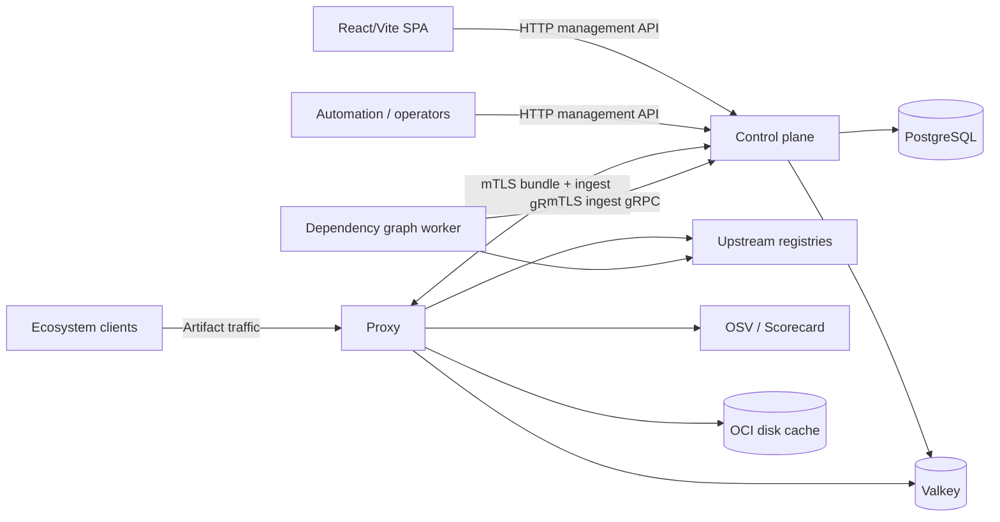
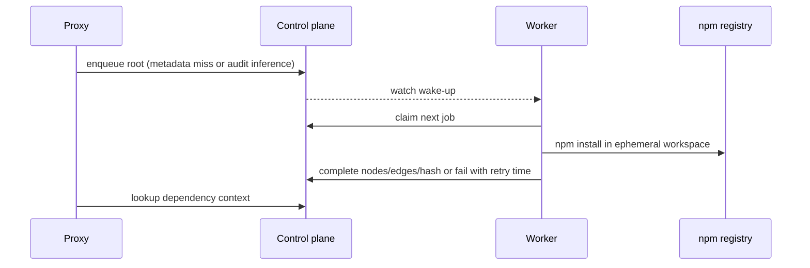

# Architecture

## Purpose

Dependency Firewall is a multi-tenant policy enforcement proxy for software package and artifact traffic. The system separates management, local request-path evaluation, durable state, and ecosystem-specific background work while shipping those compositions from one Go binary. The currently implemented protocols and their limits are listed in [`supported-ecosystems.md`](./supported-ecosystems.md).

This document is the canonical runtime, boundary, and API-responsibility overview. Protocol behavior belongs in [`proxy-behavior.md`](./proxy-behavior.md), policy semantics in [`policy-engine.md`](./policy-engine.md), state ownership in [`persistence.md`](./persistence.md), and transport identity in [`mtls.md`](./mtls.md).

## Runtime topology

| Mode | Responsibilities | Direct dependencies |
| --- | --- | --- |
| `control-plane` | Management HTTP API; OpenAPI/docs; bundle and ingest gRPC; migrations; durable repositories | PostgreSQL, Valkey; Node/npm only for an explicitly enabled in-process graph worker |
| `proxy` | Supported ecosystem HTTP routes; bundle-backed evaluation; proxy health | Valkey, control-plane gRPC, upstream registries |
| `all-in-one` | Control-plane and proxy HTTP on one mux; local bundle/ingest adapters | PostgreSQL, Valkey; Node/npm only for an explicitly enabled in-process graph worker |
| `dependency-graph-worker` | Claim, resolve, complete, and fail npm graph jobs | Node/npm, upstream npm registry, control-plane gRPC |

`dependency_graph.run_in_process` defaults to `false`. All-in-one mode therefore needs either a separate worker or explicit in-process enablement to consume queued graph jobs.

## System context

The SPA is built and served independently. The Go server does not expose `web/dist`, and Compose does not currently deploy a web service.

## Security boundaries

### Internal gRPC

Split proxy and worker connections to the control plane require mTLS. The control plane extracts the client certificate identity and authorizes the `tenant_id` associated with each RPC through `bundle.tls.authorized_clients`.

Bundle secrets for authenticated OCI upstreams are encrypted to the requesting proxy certificate. Worker claim and watch requests carry `dependency_graph.tenant_id`; the control plane authorizes that scope against the worker certificate and filters claims and wake-up notifications by tenant. The default `"*"` scope preserves global-worker behavior and requires wildcard certificate authorization.

### Public HTTP

Management and proxy HTTP routes do not currently validate bearer tokens or enforce roles. Tenant middleware resolves tenant context from API headers or ecosystem-specific routing, but that is routing and scoping—not proof that a caller may act for the tenant.

The SPA provides a provider-neutral authentication adapter, token attachment in the API client, and UI guard/state seams. Its default adapter is anonymous and current route guards do not require a session. Real IdP integration, Go JWT/JWKS validation, RBAC, and user-to-tenant membership enforcement remain future work. Deploy public HTTP behind a trusted network or an external authenticated gateway.

## Internal layers

### Delivery

Delivery owns HTTP/gRPC parsing, protocol behavior, boundary validation, and response rendering. Huma is limited to the control-plane API. Current ecosystem adapters use `net/http` handlers.

Handlers normally orchestrate through core services. Some current delivery components receive repository ports directly for read-oriented workflows, including dependency-graph inspection and bundle-backed proxy lookups. The stable boundary is that delivery must not depend on concrete infrastructure implementations or issue direct SQL/Valkey operations; new business workflows should live in core services.

### Core

Core owns artifact normalization, enrichment planning, policy evaluation, cache-aware access decisions, graph-context orchestration, policy lifecycle, audit workflows, and protocol-neutral ports. Policy evaluation is pure and deny-wins.

### Infrastructure

Infrastructure implements PostgreSQL repositories, Valkey caches, bundle-backed repositories, gRPC clients, OCI disk caching, registry clients, enrichers, encryption, and telemetry adapters. It must not contain policy or HTTP behavior.

## Control-plane HTTP API

The control plane publishes OpenAPI at `/api/openapi` and interactive documentation at `/api/docs`. Registered Huma operations are authoritative.

| Resource | Operations |
| --- | --- |
| Health | health operation registered by the control-plane health handler |
| Tenants | create, list, get, update, delete under `/api/v1/tenants` |
| Upstreams | create, list, get, update, delete under `/api/v1/upstreams` |
| Policies | create, list, get, update, delete under `/api/v1/policies` |
| Policy lifecycle | list `/api/v1/policy-types`; import `/api/v1/policies/import`; list versions and rollback under `/api/v1/policies/{id}` |
| Evaluations | list `/api/v1/evaluations` |
| Audit events | list `/api/v1/audit/events` |
| Caches | clear decision or metadata cache through `/api/v1/cache/decisions` and `/api/v1/cache/metadata` |
| Dependency graphs | list `/api/v1/dependency-graphs`; get `/api/v1/dependency-graphs/{id}` |

Audit-event browsing is API-only today; the SPA has no audit route.

## Internal gRPC responsibilities

Wire constants and DTOs live under `internal/wire`; this inventory intentionally documents responsibilities rather than duplicating schemas.

### Bundle service

- `GetTenantBundle`: return the tenant, enabled policies, upstreams, revision, and proxy-ready upstream auth envelopes for one authorized tenant.

### Proxy ingest service

- decision persistence and reads: `RecordDecision`, `GetDecisionByArtifact`, `ListDecisionsByTenant`, `HasRecentAllow`
- audit persistence: `RecordAuditEvent`
- graph queue lifecycle: `EnqueueDependencyGraphResolve`, `ClaimDependencyGraphResolve`, `CompleteDependencyGraphResolve`, `FailDependencyGraphResolve`, `WatchDependencyGraphResolve`
- graph lookup: `LookupDependencyGraphContext`

`HasRecentAllow` supports the OCI blob gate. Its current identity excludes `upstream_id`; see the documented constraint in [`proxy-behavior.md`](./proxy-behavior.md).

## Request-path policy flow

For an enforceable artifact, the proxy:

1. Resolves tenant and upstream context.
2. Normalizes the artifact and resolves ecosystem-specific mutable references when necessary.
3. Loads enabled policies from the cached tenant bundle.
4. Looks up ecosystem-specific dependency context when an applicable target-aware policy needs it; this is currently implemented for npm.
5. Computes cache identity and checks the decision cache.
6. Runs only enrichment required by applicable policies.
7. Evaluates every applicable rule in deterministic priority order.
8. Persists/caches the decision and emits audit events.

Any matching deny wins. Allow rules do not bypass a later deny. Evaluation errors fail closed. Priority determines ordering and which deny reason is surfaced first, not override precedence.

Bare npm packuments have no enforceable version and deliberately skip enrichment, decision caching, and decision persistence. OCI blobs do not rerun this flow; they require a recent manifest-level allow for the repository.

### Request-path scanning constraint

The proxy does not execute or scan package contents inline as part of policy
evaluation. Request-path decisions use normalized artifact identity, configured
metadata/enrichment providers, and precomputed dependency context.

Introducing inline artifact execution or scanning is an architectural change,
not an enrichment implementation detail, because it changes request-path
isolation, latency, resource, and failure characteristics.

## Bundle availability

The split proxy caches bundles in process and refreshes them on demand after `bundle.refresh_interval`. When refresh fails, an existing bundle is used as last-known-good; a tenant with no cached bundle cannot be served.

This cache protects policy/upstream reads only. Decision and audit writes remain synchronous ingest dependencies for uncached requests, subject to configured audit failure behavior. Do not describe bundle caching as complete control-plane outage independence.

## npm dependency graph architecture

The implemented graph subsystem resolves root npm package versions asynchronously:

PostgreSQL stores roots, nodes, edges, and context summaries. The worker uses a temporary workspace, disables scripts/audit/funding/git dependencies, and applies concurrency and timeout bounds. This is process/workspace isolation, not an OS or container sandbox.

Five-second polling is the fallback to the watch stream. Failed work retries indefinitely after a fixed delay. There is no attempt cap, dead-letter state, completed-root refresh, or invalidation API. See [`async-npm-dependency-graph.md`](./async-npm-dependency-graph.md).

Project/environment-scoped uploaded graphs, revisions, and activation are a distinct possible future model; they are not a remaining phase of this resolver.

## Deployment constraints

- Split `proxy` and `dependency-graph-worker` modes require mTLS.
- Control-plane mode requires mTLS unless the explicit insecure local-development override is enabled.
- Only control-plane/all-in-one open PostgreSQL and run migrations.
- The proxy uses Valkey but no PostgreSQL.
- The worker uses neither PostgreSQL nor Valkey.
- Only the worker, or a process running it in-process, needs Node/npm.
- OCI artifact caching supports only the disk backend; selecting `s3` or `gcs` fails startup.
- OCI is currently GET-only/pull-only and does not authenticate client registry requests.

## Telemetry

All modes can emit OpenTelemetry spans. Instrumentation covers public HTTP, internal gRPC, PostgreSQL, Valkey, enrichment, upstream registry calls, core evaluation, and audit workflows. The browser can create route spans and propagate trace context through the shared API client.

## Future directions

The following are possible, not committed roadmap promises:

- client authentication, scoped firewall tokens, CLI/OIDC login, and registry-native challenges
- IdP adapter integration, backend JWT/JWKS validation, RBAC, and organization mapping
- S3/GCS OCI cache implementations
- OCI Scorecard/license enrichment with explicit source provenance
- asynchronous or batched audit persistence and external shipping
- project-scoped graph upload/revision/activation
- SSR only if public content or measured first-render requirements justify it
