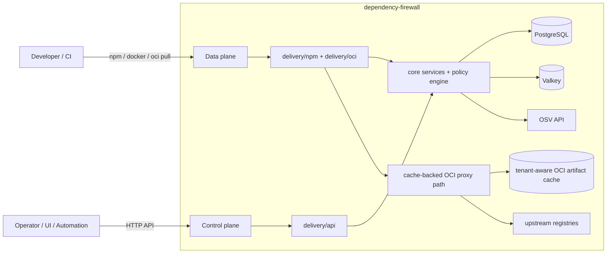
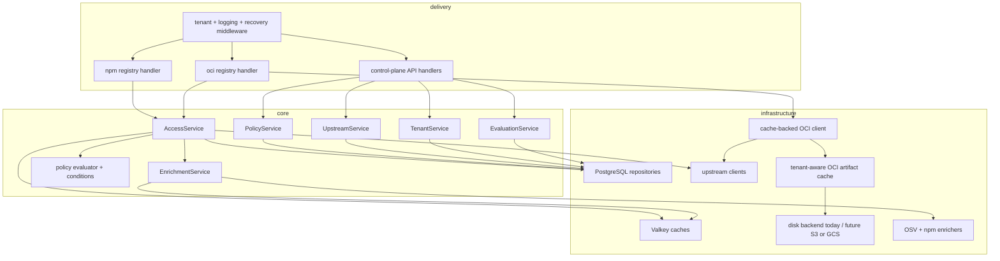
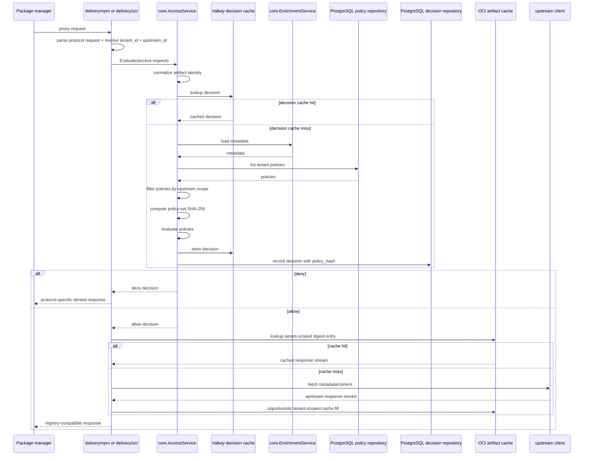
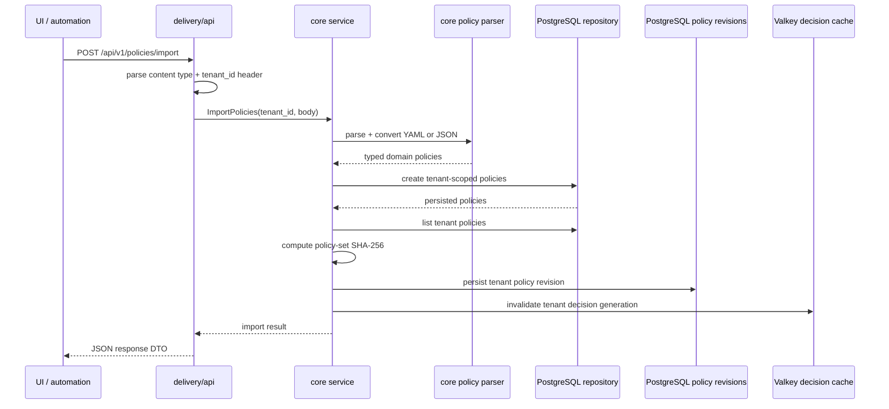

# Architecture

## Goal

Build a multi-tenant dependency firewall that acts as a policy-aware proxy for npm and OCI registries.

## Top-level shape

The system has two surfaces:

1. Data plane
   - registry-compatible proxy endpoints for package managers
   - npm and OCI protocol adapters

2. Control plane
     - management API for policies, policy rollback/history, upstreams, evaluations, and cache maintenance
     - intended for UI and automation
     - the React UI consumes generated TypeScript types from the Huma/OpenAPI document
     - Huma is used only on control-plane endpoints where code explicitly uses it

## System context



## Internal layers

### Delivery
- HTTP handlers
- npm and OCI protocol parsing
- npm and OCI proxy routes stay on plain `net/http` handlers
- OCI proxy delivery may resolve tenant identity from the request hostname for Docker-compatible traffic
- npm delivery may resolve upstream identity from `/npm/t/{tenant_id}/u/{upstream_id}/...`
- OCI delivery may resolve upstream identity from `u-{upstream_id}.{tenant_id}.{firewall-host}`
- OCI delivery should support both direct registry-hostname usage in hosted deployments and optional Docker mirror usage for transparent local development
- protocol-specific response rendering
- control-plane request DTO parsing and response DTO rendering
- Huma may be used on control-plane routes for OpenAPI/docs generation and typed request/response modeling
- Huma remains control-plane only
- the current Huma-backed control-plane set includes health, tenants, policy CRUD, policy version history, policy rollback, policy type listing, policy import, evaluation listing, decision-cache clearing, and upstream CRUD
- boundary request validation
- handlers call core services, not repositories or parser packages

### Core
- request normalization
- policy evaluation
- enrichment orchestration
- tenant-aware decision making
- upstream-aware policy selection
- upstream capability compatibility validation for policy authoring and upstream updates
- control-plane business workflows
- typed domain and policy config models
- shared ports named in protocol-neutral terms where used across ecosystems

### Infrastructure
- PostgreSQL repositories
- Valkey cache implementations
- tenant-aware OCI artifact cache implementations
- OSV enricher
- upstream registry clients

## Layered component view



## Dependency direction

- delivery depends on core
- infrastructure depends on core ports and domain
- core depends on neither delivery nor infrastructure

## Control-plane Huma boundary

### In scope

- control-plane API delivery only
- OpenAPI/docs generation at the HTTP boundary
- typed request and response models for the control-plane endpoints that use Huma
- current Huma-backed control-plane endpoints include health, tenants, policy CRUD, policy version history, policy rollback, policy type listing, policy import, evaluation listing, decision-cache clearing, and upstream CRUD
- per-endpoint Huma coverage remains explicit and human-controlled

### Out of scope

- npm delivery
- OCI delivery
- assuming every control-plane endpoint uses Huma
- assuming every future control-plane endpoint must use Huma automatically
- core service signatures or domain models
- infrastructure repositories, caches, enrichers, or upstream clients

Huma is a delivery-layer tool. It must not move policy logic, tenant workflows, or persistence concerns out of core and infrastructure. Endpoint coverage stays human-controlled and must reflect explicit code changes, not inferred drift from shared helpers or documentation alone.

## Boundary rules

- delivery must not decode API payloads directly into domain models
- YAML and JSON are boundary formats only; decode them into typed request DTOs and typed policy config structs before core workflows run
- delivery and config packages may use declarative validators for boundary shape checks, but core invariants must stay explicit in typed domain validation
- delivery must not call PostgreSQL or Valkey implementations directly
- delivery must not orchestrate multi-step policy import or evaluation workflows
- delivery must not expose raw PostgreSQL or Valkey errors to API clients; infrastructure errors should be translated to domain-safe errors and logged server-side
- core types must not carry JSON response tags for delivery concerns
- core policy config must use typed structs per policy type, not `map[string]any`
- approved-license policies must keep missing license metadata behavior explicit; current `license_allowlist` behavior is fail-closed
- shared ports in core must avoid ecosystem-specific names such as manifest, blob, or tag unless the port is OCI-only
- OCI artifact cache ports may be OCI-specific, but cache ownership, lookup, and lifecycle must remain tenant-aware across the full app lifecycle

## Data-plane evaluation flow



## Control-plane flow



## Main runtime flow

1. Request enters delivery layer.
2. Delivery resolves tenant and normalizes the request.
3. Core evaluates access using cache, enrichment, and policy.
4. If denied, delivery renders a protocol-specific error.
5. If allowed, OCI delivery checks the tenant-aware artifact cache by digest before going upstream.
6. On OCI cache miss, delivery streams content from upstream while opportunistically filling the cache.

## Deferred goal: graph-backed npm dependency context

This is a **future goal**, not part of the current v1 delivery scope.

### Problem

The current npm flow is artifact-local:

- delivery parses `package@version`
- core evaluates one artifact at a time
- policy does not know whether the artifact is direct, transitive, prod, dev, peer, or optional

That keeps the hot path simple, but it limits how age and governance policies behave for transitive dependencies.

### Recommended future direction

Use a **project-scoped resolved dependency graph** as the source of truth for npm dependency context:

- control plane accepts a lockfile or resolved graph upload per tenant_id + project + environment
- PostgreSQL stores graph revisions, nodes, edges, and activation state
- core derives a normalized dependency context per artifact within the active graph
- delivery/npm stays thin and passes tenant + project + environment + artifact to core
- Valkey caches active graph pointers, normalized artifact context summaries, and decisions

### Future control-plane shape

Recommended future capabilities:

- upload a graph revision for a tenant_id + project + environment
- list graph revisions
- activate a graph revision
- inspect graph-derived artifact context for audit and debugging

### Future policy shape

If this is implemented, policy schema should evolve with a shared selector block rather than package-specific allowlists:

```yaml
- name: block-stale-direct-deps
  type: maximum_age
  schema_version: 2
  action: deny
  priority: 25
  target:
    dependency_scope: [direct]
    dependency_types: [prod, peer]
    on_unknown: warn
  config:
    max_age_days: 730
```

### Cache and persistence impact

PostgreSQL would become the source of truth for graph state:

- `dependency_graph_revisions`
- `dependency_graph_nodes`
- `dependency_graph_edges`
- activation state per tenant_id + project + environment

Valkey would keep hot runtime lookups only:

- active graph pointer
- normalized artifact context summary per graph revision
- decision cache keys that include policy generation + graph revision + context hash

### Performance rules

This design is only acceptable if the expensive work happens **off the request path**:

- parse and normalize the graph at upload or activation time
- precompute a small artifact context summary for runtime use
- never walk dependency edges in PostgreSQL during normal npm tarball or metadata requests
- never recompute direct vs transitive classification per request

### Why deferred

This would improve correctness for transitive dependency policy, but it adds:

- more PostgreSQL storage
- more Valkey memory
- lower decision cache reuse
- more operational complexity around project and environment identity

Current direction:

- keep v1 artifact-local
- keep package-level exceptions small and explicit
- revisit graph-backed evaluation when project-scoped dependency enforcement becomes a higher priority
