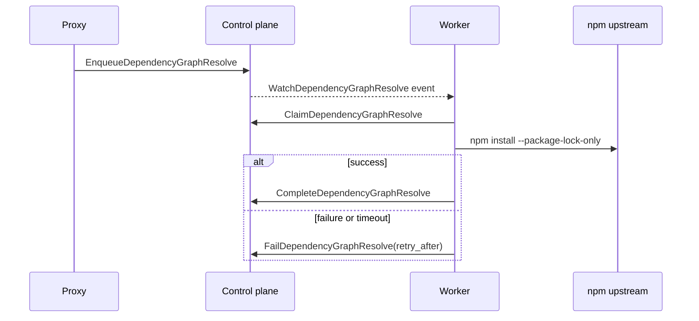

# Async npm dependency graphs

The dependency-graph subsystem resolves concrete npm root packages outside the proxy request path, persists their node/edge graph, and exposes normalized dependency context to target-aware policies.

## Runtime composition

The recommended split topology runs `runtime.mode=dependency-graph-worker`. That process is the only split service that needs Node/npm and it receives neither PostgreSQL nor Valkey credentials. It uses the ingest gRPC client for claim, completion, failure, watch, and context responsibilities.

`dependency_graph.run_in_process` defaults to `false`. In all-in-one or control-plane mode, queued jobs remain unresolved unless a separate worker runs or this option is explicitly enabled.

Configuration defaults:

```yaml
dependency_graph:
  enabled: true
  run_in_process: false
  tenant_id: "*"
  poll_interval: 5s
  timeout: 2m
  concurrency: 2
  retry_delay: 5m
```

## Job creation

Two paths enqueue roots:

1. A target-aware policy requests context for a concrete npm metadata artifact, no stored context exists, and the request is eligible to become a root.
2. The native npm bulk-audit endpoint captures an install snapshot, infers likely roots, and enqueues them asynchronously.

Tarball requests never enqueue graph work. Bare packuments do not have a version and cannot enqueue a concrete root.

Jobs are idempotent through the PostgreSQL uniqueness constraint on:

```text
tenant_id + upstream_id + root package + root version
```

There is no separate Valkey debounce key.

## Claim and wake-up lifecycle



The watch stream reduces pickup latency. Five-second polling remains active as fallback for missed events, reconnects, and retryable failed rows. Claim uses `FOR UPDATE SKIP LOCKED`, so multiple workers can claim different roots concurrently.

Claim and watch RPCs carry `dependency_graph.tenant_id`. Set it to a concrete tenant ID and authorize the worker certificate for that same tenant to filter claims and wake-up notifications. The default `"*"` scope preserves global-worker behavior and requires wildcard certificate authorization. Completion and failure requests are authorized against the tenant on the claimed job.

## npm execution

Each job:

1. creates a temporary workspace;
2. writes a private minimal `package.json`;
3. invokes npm for `root@version` against the configured upstream;
4. creates a package lock without installing runtime files;
5. parses nodes, edges, minimum depth, and dependency types;
6. hashes the normalized graph;
7. removes the temporary workspace.

The npm invocation uses:

```text
--package-lock-only
--ignore-scripts
--no-audit
--no-fund
--allow-git=none
```

Concurrency and per-job timeout are bounded. This is an ephemeral workspace with a hardened npm invocation; the Go implementation does not create an OS, VM, or container sandbox.

npm upstream authentication is not currently supplied to the resolver.

## Persistence

PostgreSQL stores:

- `dependency_graph_roots`: tenant/upstream root and job status;
- `dependency_graph_nodes`: normalized artifact, minimum depth, dependency types;
- `dependency_graph_edges`: parent, child, and relationship type;
- `dependency_context_summaries`: artifact lookup context per root.

Completion transactionally replaces nodes and summaries for the root, writes edges, stores the graph hash, and marks the root complete.

Dependency scope is derived as:

- root: direct context for itself;
- depth 1: direct dependency;
- depth greater than 1: transitive dependency;
- absent or conflicting evidence: unknown.

Dependency types are `prod`, `dev`, `peer`, and `optional`.

## Request-path lookup

For an applicable target-aware npm policy, the proxy checks:

1. Valkey context cache, keyed by tenant, upstream, and artifact;
2. durable context summary through local or gRPC lookup;
3. eligible root enqueue on a miss;
4. unknown context while work is pending or unavailable.

Context is cached for 30 minutes. Its normalized hash is included in decision-cache identity.

## Retry and refresh limitations

Current recovery behavior is deliberately simple:

- failures are marked `failed` with an error and `updated_at` set to the fixed retry time;
- failed jobs are retried indefinitely after `dependency_graph.retry_delay`;
- there is no exponential backoff, attempt counter, maximum-attempt policy, or dead-letter state;
- completion is reused because a duplicate enqueue conflicts with the unique root key;
- completed roots are not automatically refreshed when upstream metadata changes;
- there is no graph invalidation, requeue, or force-refresh API;
- a worker crash while a row is `resolving` has no documented lease-recovery mechanism.

Operators can inspect status/error through the API and logs. Recovery beyond the automatic fixed-delay retry currently requires direct operational intervention; no supported mutation endpoint exists.

## Control-plane API

| Operation | Endpoint | Behavior |
| --- | --- | --- |
| List roots | `GET /api/v1/dependency-graphs` | tenant-scoped status inventory; `limit` 1–500, default 100 |
| Get snapshot | `GET /api/v1/dependency-graphs/{id}` | tenant-scoped root, nodes, and edges |

Both require `X-Tenant-ID` for scoping. Current public HTTP does not authenticate that header.

## UI workflow

The Dependency Graphs page provides:

- root inventory and pending/resolving/complete/failed status;
- graph selection and status/error detail;
- D3 relationship visualization;
- package-name/version search;
- maximum-depth filtering;
- prod/dev/peer/optional type filters;
- node and edge detail;
- zoom, reset, and drag interactions.

The UI reads only the two API operations above; it cannot enqueue, retry, invalidate, or refresh a root.

## Observability

Worker logs include tenant, upstream, artifact, duration, node/edge counts, and failure detail. gRPC and core work participate in OpenTelemetry when telemetry is enabled.

## Separate possible future model

Project/environment-scoped graph uploads, revisions, activation, and client-supplied lockfiles are a distinct possible future design. They are not unfinished phases of the implemented root-package resolver.
