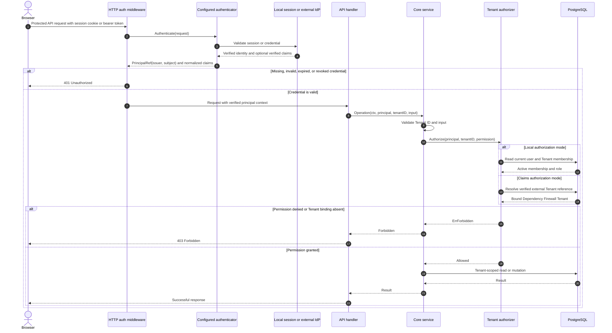
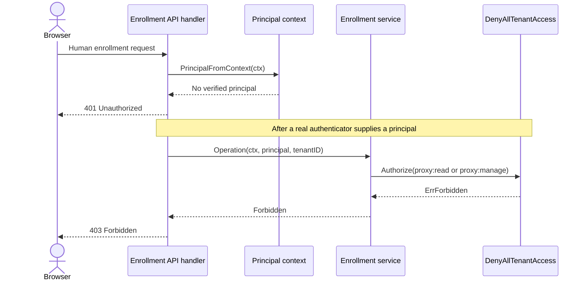

# Human authentication and authorization progress

This document tracks delivery of the provider-neutral human identity and Tenant
authorization plan originally recorded at
`~/.devin/plans/plan-dc64f23f94618b05.md`. It is a session-resumption checklist,
not the source of truth for runtime behavior. Update the canonical documents in
the documentation map whenever implementation behavior changes.

## Current position

- Updated: 2026-08-24
- Repository: `/Users/danielterry/git/dependency-firewall`
- Branch: `feat/self-hosted-proxy-enrollment`
- Current phase: PR #32 durable enrollment contract amendment
- Status: implementation and verification complete; changes remain uncommitted
- Next phase: PR 33 common human authentication and authorization framework

## Intended authentication and authorization sequence

The target request path authenticates once at the HTTP boundary, carries only
verified provider-neutral state in request context, and makes a separate
authorization decision inside the core workflow. Authentication proves who the
caller is; it never proves that the caller may access the requested Tenant.

External providers may supply verified claims, but provider roles and raw token
claims do not enter core workflows. An adapter maps them to Dependency Firewall
permissions first. In local mode, authorization ignores claims and reads current
account and membership state from PostgreSQL so disablement or membership
removal takes effect immediately.

### Current PR #32 behavior

PR #32 implements the principal context and service authorization seams but no
human authenticator or Tenant-access adapter. The shipped path therefore stops
safely before an enrollment operation can run:

Public machine enrollment start and one-time device polling do not use this
human authentication flow. Device bearer credentials must remain routed to the
machine polling boundary rather than being interpreted as human IdP tokens.

## PR #32 durable enrollment contracts

- [x] Add provider-neutral `PrincipalRef` using exact `issuer + subject` identity.
- [x] Add the initial Dependency Firewall permission catalog.
- [x] Add Tenant and system authorization ports.
- [x] Replace enrollment-specific authorization with permission-aware Tenant authorization.
- [x] Keep production bootstrap fail closed with no authenticated human context and deny-all Tenant access.
- [x] Require authenticated principal context for activation-code resolution, approval, denial, and installation management.
- [x] Enforce `proxy:read` for installation list/get.
- [x] Enforce `proxy:manage` for approval, rename, and revoke.
- [x] Validate Tenant UUIDs before invoking an authorization adapter.
- [x] Keep denial authenticated and code-bound without accepting a client-selected Tenant as proof of authorization.
- [x] Persist approving and denying principal issuer/subject pairs through migration 000021 and PostgreSQL repository operations.
- [x] Backfill migration 000020 principal IDs under an explicit legacy issuer.
- [x] Add pairwise database constraints and a reversible down migration.
- [x] Update focused service, delivery, middleware, migration, and repository tests.
- [x] Regenerate OpenAPI and TypeScript API artifacts.
- [x] Update `docs/architecture.md`, `docs/persistence.md`, `docs/mtls.md`, and `docs/ui-redesign.md`.
- [x] Review the final diff for fail-closed behavior, Tenant scope, stale contract names, and unintended files.

### Verification evidence

Run on 2026-08-24:

- [x] `make fmt`
- [x] Focused tests for core service, delivery API, and principal middleware
- [x] `make lint` — completed with zero issues; sandbox prevented only lint-cache persistence
- [x] `make test`
- [x] `make test-integration`
- [x] `npm --prefix web run generate:api`
- [x] `npm --prefix web run lint`
- [x] `npm --prefix web run build`
- [x] `npx playwright test tests/e2e/tenant-overview.spec.ts` from `web/` — 10 passed across desktop and mobile
- [x] `git diff --check`

### Handoff before PR submission

- [ ] Review the uncommitted diff interactively.
- [ ] Decide whether PR #32 should remain one commit or be amended with a follow-up commit.
- [ ] Commit and push only after explicit approval.
- [ ] Confirm PR checks after pushing.

## Remaining delivery sequence

These phases are planned but not implemented by the PR #32 work:

- [ ] PR 33 — common human authentication/authorization framework and documentation.
- [ ] PR 34 — local identity persistence, password service, and first-admin CLI.
- [ ] PR 35 — local login, sessions, CSRF protection, and rate limiting.
- [ ] PR 36 — local Tenant access and proxy enrollment end to end.
- [ ] PR 37 — local member directory and Members UI.
- [ ] PR 38 — external Tenant bindings and claims-authorization foundation.
- [ ] PR 39 — Clerk authentication and active-Organization authorization.
- [ ] PR 40 — Clerk directory adapter and SaaS member UI.
- [ ] PR 41 — generic OIDC server-side login.
- [ ] PR 42 — generic OIDC claims authorization.
- [ ] PRs 43+ — apply authorization to the remaining control-plane operations.

## Invariants for subsequent phases

- Tenant remains the hard security and data-isolation boundary.
- Caller-selected Tenant, Organization, or Team identifiers never prove authorization.
- Authentication and authorization remain separate server-side decisions.
- Services receive principals explicitly and authorize before reading or mutating Tenant-owned state.
- Identity equality uses exact issuer and subject values; email and display name are non-authoritative metadata.
- No allow-all, trusted-header, frontend-only, or development authentication path may reach production wiring.
- Machine enrollment credentials remain separate from human bearer/session authentication.
- Policy evaluation remains deterministic and deny-wins.

## How to resume

1. Inspect `git status -sb` and `git diff --check`; preserve the existing uncommitted PR #32 changes.
2. Re-read the relevant canonical documents and the next phase in the original plan.
3. Verify runtime wiring before treating contracts, migrations, generated artifacts, or UI state as implemented behavior.
4. Update this tracker when a phase starts, when verification changes, and when a PR merges.
5. Record exact commands and outcomes; never mark a check complete unless it was run.
