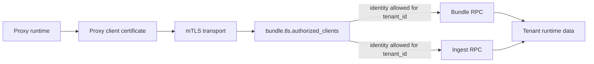

# mTLS Configuration

Split `control-plane` and `proxy` deployments must use mTLS for bundle and ingest gRPC. This connection carries tenant bundles, durable decision writes, audit events, and authenticated upstream auth envelopes when OCI upstream auth is configured.

The configuration is process-local. In a split deployment, mount a control-plane config and the control-plane server certificate/key into the control-plane container, and mount a proxy config and the proxy client certificate/key into each proxy container. Do not mount the proxy private key into the control plane or the control-plane private key into the proxy.

## Security model



mTLS authenticates the process on each side of the connection. Tenant authorization is a separate check: the control plane reads the proxy certificate identity and verifies that identity is allowed to access the `tenant_id` carried by the bundle or ingest RPC.

For bundle delivery, the proxy client certificate is also the recipient key for upstream auth secrets. The control plane encrypts each configured upstream password/PAT/token to the requesting proxy certificate public key before placing it in the bundle response. The proxy keeps those version-2 envelopes in the runtime bundle cache and decrypts them with its local certificate private key only while constructing outbound OCI registry auth.

## Certificate requirements

- Use a private CA or workload identity provider controlled by the deployment.
- Do not commit private keys to the repository or bake them into public images.
- The control-plane server certificate must be valid for the name the proxy dials, or the proxy must set `bundle.tls.server_name_override`.
- The proxy client certificate must contain a stable identity in a DNS SAN, URI SAN, email SAN, or Common Name.
- The control plane must list that exact identity in `bundle.tls.authorized_clients`.
- Treat proxy private keys as bundle-secret decryption keys. A proxy can decrypt only envelopes encrypted to its own certificate public key.

The examples below use DNS SANs because they are easy to issue and understand in local and self-managed deployments. The same authorization model works with any stable certificate identity the code can extract. SPIFFE URI SANs are also supported when a deployment actually uses SPIFFE/SPIRE or another workload identity system that issues SPIFFE IDs.

| Certificate field | Example `authorized_clients.identity` |
| --- | --- |
| DNS SAN | `proxy-a.firewall.internal` |
| URI SAN | `spiffe://dependency-firewall/proxy/proxy-a` |
| Email SAN | `proxy-a@firewall.internal` |
| Common Name | `proxy-a` |

## Control-plane config

The control plane listens for bundle and ingest gRPC on `bundle.listen_addr`. In split deployments, `bundle.tls.mode` should be `mtls`, and `bundle.tls.authorized_clients` must map client certificate identities to tenant IDs.

This config belongs in the control-plane process/container. It needs the CA bundle, the control-plane server certificate/key, and the list of proxy identities that may access tenants.

```yaml
runtime:
  mode: control-plane

bundle:
  listen_addr: ":9090"
  tls:
    mode: mtls
    ca_file: "/etc/firewall/tls/ca.pem"
    cert_file: "/etc/firewall/tls/control-plane.pem"
    key_file: "/etc/firewall/tls/control-plane-key.pem"
    authorized_clients:
      - identity: "proxy-a.firewall.internal"
        tenant_ids:
          - "tenant-a"
          - "tenant-b"
      - identity: "admin-proxy.firewall.internal"
        tenant_ids:
          - "*"
```

`tenant_ids: ["*"]` grants that proxy certificate identity access to every tenant. Use it only for intentionally shared administrative proxies.

For local development only, a control-plane process can explicitly opt out of this requirement:

```yaml
runtime:
  mode: control-plane

bundle:
  tls:
    mode: insecure
    allow_insecure_control_plane: true
```

When this override is active, startup logs emit a warning that control-plane gRPC is running without mTLS. Do not use this for shared environments or any deployment that carries authenticated upstream secrets.

## Proxy config

The proxy dials the control plane using `bundle.control_plane_addr`. In `proxy` mode, `bundle.tls.mode` must be `mtls`.

This config belongs in the proxy process/container. It needs the CA bundle and that proxy's client certificate/key. It does not need `authorized_clients`; tenant authorization is enforced by the control plane.

```yaml
runtime:
  mode: proxy

bundle:
  control_plane_addr: "control-plane.firewall.svc.cluster.local:9090"
  refresh_interval: 30s
  tls:
    mode: mtls
    ca_file: "/etc/firewall/tls/ca.pem"
    cert_file: "/etc/firewall/tls/proxy-a.pem"
    key_file: "/etc/firewall/tls/proxy-a-key.pem"
    server_name_override: "control-plane.firewall.svc.cluster.local"
```

Leave `server_name_override` empty when the dial address already matches the control-plane certificate SAN. Set it only when the network address and certificate name differ, such as dialing an IP address while the certificate is issued for a DNS name.

## Testing certificates

The following commands create a local CA plus one control-plane server certificate and one proxy client certificate for development tests. Do not use these keys in production.

For a runnable split-mode Docker Compose example with separate mounted configs, see [`examples/mtls`](../examples/mtls/README.md).

```bash
mkdir -p .local/mtls

openssl genrsa -out .local/mtls/ca-key.pem 4096
openssl req -x509 -new -nodes \
  -key .local/mtls/ca-key.pem \
  -sha256 -days 30 \
  -subj "/CN=dependency-firewall-test-ca" \
  -out .local/mtls/ca.pem

openssl genrsa -out .local/mtls/control-plane-key.pem 2048
openssl req -new \
  -key .local/mtls/control-plane-key.pem \
  -subj "/CN=control-plane.firewall.local" \
  -out .local/mtls/control-plane.csr
openssl x509 -req \
  -in .local/mtls/control-plane.csr \
  -CA .local/mtls/ca.pem \
  -CAkey .local/mtls/ca-key.pem \
  -CAcreateserial \
  -out .local/mtls/control-plane.pem \
  -days 30 -sha256 \
  -extfile <(printf "subjectAltName=DNS:control-plane.firewall.local,DNS:localhost,IP:127.0.0.1\nextendedKeyUsage=serverAuth\n")

openssl genrsa -out .local/mtls/proxy-a-key.pem 2048
openssl req -new \
  -key .local/mtls/proxy-a-key.pem \
  -subj "/CN=proxy-a" \
  -out .local/mtls/proxy-a.csr
openssl x509 -req \
  -in .local/mtls/proxy-a.csr \
  -CA .local/mtls/ca.pem \
  -CAkey .local/mtls/ca-key.pem \
  -CAcreateserial \
  -out .local/mtls/proxy-a.pem \
  -days 30 -sha256 \
  -extfile <(printf "subjectAltName=DNS:proxy-a.firewall.local\nextendedKeyUsage=clientAuth\n")
```

Use these paths in the control-plane config file mounted into the control-plane container:

```yaml
bundle:
  listen_addr: ":9090"
  tls:
    mode: mtls
    ca_file: ".local/mtls/ca.pem"
    cert_file: ".local/mtls/control-plane.pem"
    key_file: ".local/mtls/control-plane-key.pem"
    authorized_clients:
      - identity: "proxy-a.firewall.local"
        tenant_ids:
          - "tenant-a"
```

Use these paths in the proxy config file mounted into the proxy container:

```yaml
bundle:
  control_plane_addr: "127.0.0.1:9090"
  tls:
    mode: mtls
    ca_file: ".local/mtls/ca.pem"
    cert_file: ".local/mtls/proxy-a.pem"
    key_file: ".local/mtls/proxy-a-key.pem"
    server_name_override: "control-plane.firewall.local"
```

The proxy certificate DNS SAN is `proxy-a.firewall.local`, so the control-plane `authorized_clients.identity` must use that exact value. If you use a URI SAN, email SAN, or Common Name instead, change the identity value accordingly.

## Validation rules

- `runtime.mode=control-plane` requires `bundle.tls.mode=mtls`, unless `bundle.tls.allow_insecure_control_plane=true` is explicitly set for local development.
- `runtime.mode=proxy` requires `bundle.tls.mode=mtls`.
- `runtime.mode=dependency-graph-worker` requires `bundle.tls.mode=mtls` and uses `bundle.control_plane_addr` to claim and complete graph jobs.
- In worker mode, the `bundle` section is transport-only: it configures the mTLS client to the control plane, not tenant bundle retrieval or caching.
- `bundle.tls.mode=mtls` requires `ca_file`, `cert_file`, and `key_file`.
- `runtime.mode=control-plane` plus `bundle.tls.mode=mtls` requires at least one `authorized_clients` entry.
- Authenticated OCI upstream secrets are delivered in bundles only when the bundle transport is mTLS-protected and tenant-authorized.
- Split-mode proxy runtime requires bundle-delivered auth secrets to be version-2 encrypted envelopes and rejects plaintext bundle secrets. All-in-one mode uses the legacy-compatible resolver for local in-process flows.

## Operational checklist

- Issue separate certificates for each proxy and dependency graph worker deployment.
- Keep control-plane, proxy, and dependency graph worker configs separate in split deployments; each process should receive only its own certificate/key.
- Keep the worker's `bundle` config limited to the control-plane address and mTLS client credentials; it should not reuse proxy bundle cache settings.
- Authorize each proxy and worker identity only for the tenants it should serve. Set a tenant-scoped worker's `dependency_graph.tenant_id` to the same concrete tenant ID. Use `"*"` in both places only for a global worker that should claim jobs across all tenants.
- Rotate proxy certificates by adding the new identity to `authorized_clients`, deploying the new cert, then removing the old identity.
- Protect key files with filesystem permissions readable only by the firewall process.
- Use one CA bundle for the trust anchors that should be allowed to participate in control-plane gRPC.
- Rotate proxy certificates deliberately: new bundle envelopes are encrypted to the active proxy certificate public key, so a running proxy must have the matching private key.

## Tenant-scoped workers

Worker claim and watch requests carry the configured `dependency_graph.tenant_id`. The control plane authorizes that tenant against the worker certificate, filters PostgreSQL claims to it, and sends only matching wake-up notifications. Completion and failure requests continue to be authorized using the tenant on the claimed job.

For an authorization-enforced tenant worker, configure both sides with the same tenant:

```yaml
# worker.yaml
dependency_graph:
  tenant_id: "00000000-0000-0000-0000-000000000001"

# control-plane.yaml
bundle:
  tls:
    authorized_clients:
      - identity: "tenant-a-worker.firewall.local"
        tenant_ids:
          - "00000000-0000-0000-0000-000000000001"
```

The default tenant scope is `"*"` for backward compatibility. It requires wildcard certificate authorization and is appropriate only for a worker intended to process every tenant.
