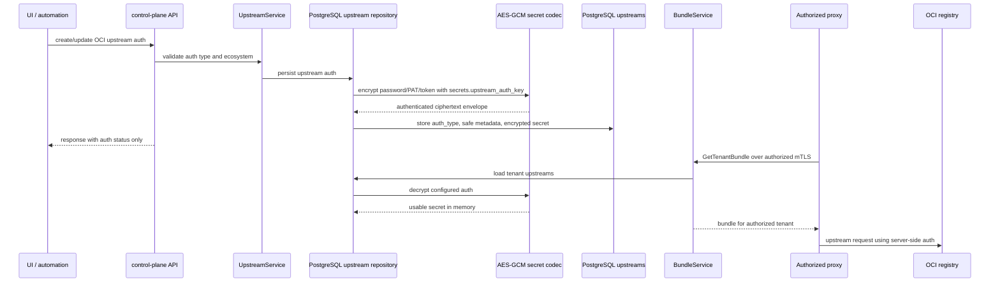

# Persistence

## PostgreSQL

PostgreSQL is the system of record.

- only control-plane and all-in-one runtimes open PostgreSQL connections directly
- proxy mode loads tenant runtime from bundles and sends durable decision or audit writes back through the control-plane ingestion service
- bundle construction is a control-plane workflow backed by PostgreSQL tenant, upstream, and policy state

### Core tables
- tenants
- users
- tenant_memberships
- upstreams
- policies
- policy_versions
- tenant_policy_revisions
- artifacts
- proxy_requests
- evaluations
- evaluation_reasons
- decisions
- audit_events

### Rules
- every tenant-owned table includes tenant_id
- operational tables are indexed by tenant_id and timestamp
- upstreams are unique by `tenant_id + ecosystem + base_url`
- upstreams persist a `capabilities` profile so policy compatibility checks are stable across API, UI, and evaluation workflows
- OCI upstreams may persist server-side auth metadata plus encrypted Basic/PAT or bearer-token secrets; API responses expose only auth status and safe metadata
- upstream auth secrets are encrypted with the configured `secrets.upstream_auth_key`; runtimes fail closed when encrypted auth is needed but the key is unavailable
- when a new capability is added to an ecosystem default set, legacy upstream rows that still match the previous default profile may be backfilled to the new default so existing tenants can use newly introduced compatible policy types
- policies may reference one upstream through `upstream_id`
- `policies.upstream_id` and `policy_versions.upstream_id` are nullable only for legacy tenant-wide rules
- upstream references use foreign keys so upstream deletion is blocked while policies still point at it
- use JSONB only for flexible fields
- `policies.schema_version` and `policy_versions.schema_version` record the policy-item schema used for that row
- `policy_versions` stores retained policy snapshots for rollback and keeps the latest 3 versions per policy
- `tenant_policy_revisions` stores the canonical tenant policy-set hash and generation after every policy mutation
- decisions store the `policy_hash` that was active when the decision was evaluated
- `audit_events` stores append-only structured audit records for proxy request, evaluation, decision, and upstream-fetch activity
- audit event payloads use JSONB for flexible structured details, but top-level filtering still relies on tenant_id, event_type, and created_at indexes
- audit queries must stay tenant-scoped and should support correlation lookups by request ID and artifact identity fields
- durable audit persistence is expected to support incident response; sink-failure behavior is configurable and defaults to fail-closed
- proxy-side durable writes arrive through the control-plane ingestion service before they reach `decisions` and `audit_events`

### Upstream auth secret lifecycle

Secret rules:
- plaintext credentials only exist in request memory, repository decrypt/encrypt memory, proxy bundle memory, and outbound registry requests
- PostgreSQL stores encrypted secret envelopes, not plaintext credentials
- control-plane API responses and UI details never include password, PAT, or bearer token values
- split-mode bundles can include usable auth only after mTLS peer verification and tenant authorization

### audit_events

- intended for forensic and incident-response workflows, not just UI history
- one row per structured audit event
- expected payload fields include:
  - `correlation_id`
  - `source`
  - `message`
  - `outcome`
  - `upstream_id`
  - `policy_id`
  - `artifact`
  - `details`
- phase 1 uses both:
  - `event_type` column for exact filtering
  - JSONB payload fields for richer search and future expansion
- indexes should cover:
  - `tenant_id + created_at`
  - `tenant_id + event_type + created_at`
  - `tenant_id + correlation_id + created_at`
  - JSONB payload search

## Valkey

Valkey is used for:
- decision cache
- metadata cache
- proxy-local caching in split mode
- runtime access through `github.com/valkey-io/valkey-go` while keeping the operator-facing config under `valkey.addr`, `valkey.password`, and `valkey.db`
- OpenTelemetry client spans reporting `db.system=valkey`

### Cache rules
- keys must include tenant and normalized artifact identity
- long-lived decisions should prefer immutable identities such as digests
- TTL should vary by reason type and freshness of the artifact
- OCI artifact cache keys must include `tenant_id`, `upstream_id`, artifact kind, and immutable digest; do not reuse cached OCI content across upstreams even when digests match
