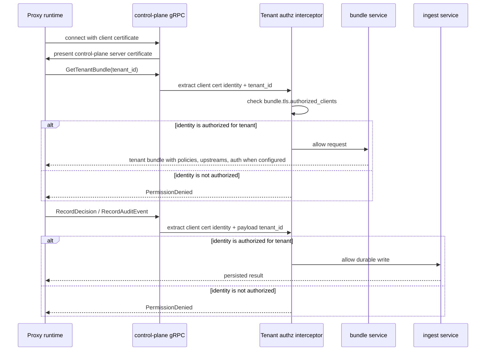
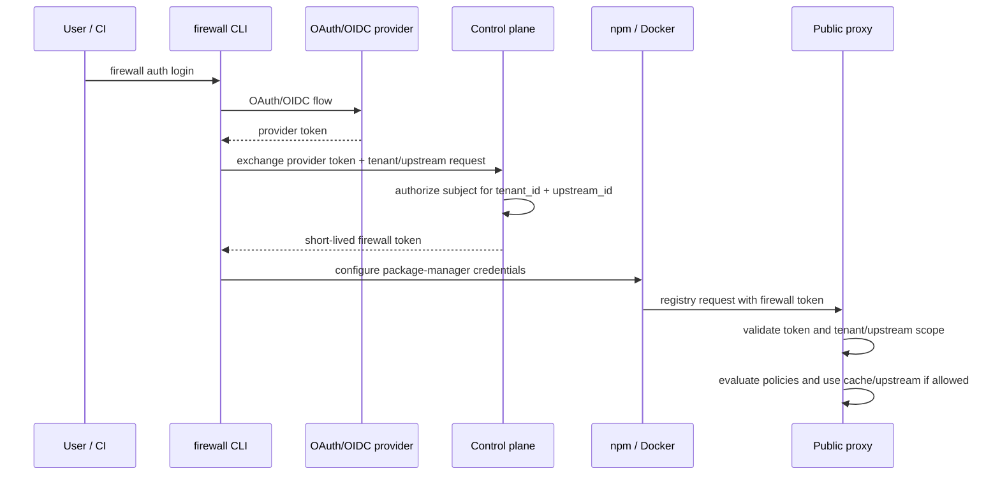
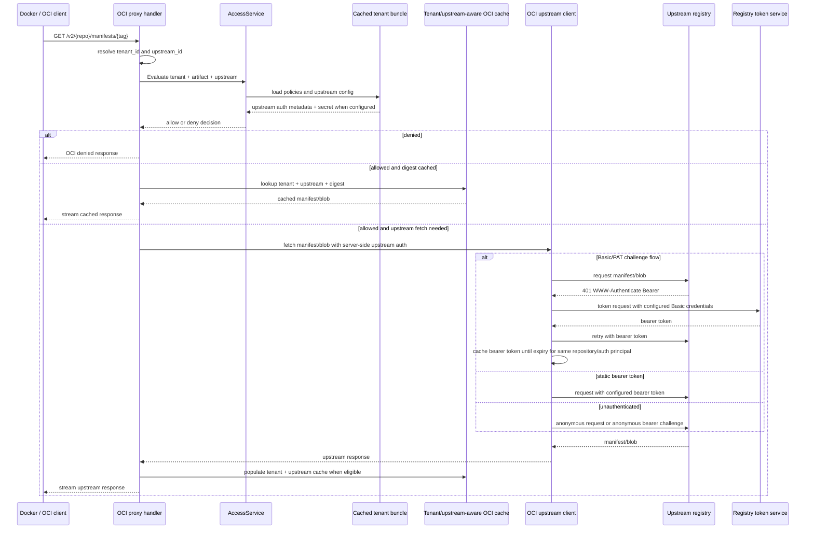

# Proxy Behavior

## Delivery boundary

- Huma is control-plane only.
- npm and OCI proxy routes remain plain `net/http` delivery handlers.
- The control plane and proxy can run as separate services.
- The proxy pulls tenant bundles from the control plane over gRPC and evaluates requests locally.
- Tenant identity, status, upstreams, and compiled policy data come from the cached tenant bundle, not PostgreSQL.
- Proxy decision and audit persistence flows through the control-plane ingestion boundary, not direct PostgreSQL repositories.
- All-in-one mode keeps the same bundle and ingestion boundaries but satisfies them in-process for local development.
- Split-mode deployments must run bundle and ingest gRPC with mTLS.
- The control plane authorizes each proxy client certificate identity for explicit tenant IDs before serving bundles or ingesting decisions/audit events.
- Registry credentials are not sent over insecure control-plane gRPC.
- New npm and OCI client setup should use explicit upstream-specific routes or hostnames.
- Legacy tenant-only routes and hostnames remain available and resolve to the most recently updated upstream for that tenant and ecosystem.

For complete upstream/ecosystem extension guidance, see `docs/adding-upstream.md`.

## Protocol adapter extension checklist

Use this checklist when adding a new proxy protocol adapter or significantly extending npm/OCI behavior.

1. Add/update delivery parsing under `internal/delivery/<protocol>/`.
2. Resolve `tenant_id` and `upstream_id` from route/host shape.
3. Normalize request into `domain.AccessRequest`.
4. Call `AccessService.Evaluate` before upstream fetch.
5. Keep deny and allow responses protocol-compatible.
6. Keep audit flow aligned with current handlers and shared helper boundaries in `internal/delivery/proxyflow/`.
7. Keep upstream fetch and cache operations tenant/upstream-scoped.
8. Add protocol-focused tests for resolution + deny/allow behavior.

### Required invariants

- Do not bypass `AccessService` with direct policy or repository calls.
- Keep deny-wins behavior and policy evaluation ordering unchanged.
- Keep enrichment conditional on policy metadata requirements.
- Keep version-sensitive enrichment and decision caching limited to requests that identify a concrete version, digest, or resolver-backed immutable reference.
- Keep split-mode tenant authorization and mTLS expectations unchanged.
- Keep cache isolation by both `tenant_id` and `upstream_id`.

### Expected test paths

- `internal/delivery/<protocol>/*_test.go`
- `internal/core/service/proxy_test.go`
- `internal/core/policy/*_test.go` when compatibility or policy metadata is affected

## Split-mode auth and authorization

## Future: public proxy client auth

Current split-mode mTLS authenticates and authorizes the proxy when it talks to the control plane. It does not authenticate package-manager clients that call a public proxy. A public deployment should add data-plane client authentication before policy evaluation, OCI cache lookup, or upstream fetch.

Required before exposing the proxy as a public or multi-tenant SaaS data plane:

- authenticate and authorize package-manager clients before applying stored upstream registry credentials, so the proxy cannot be used as an unauthenticated credential relay for private registries
- require HTTPS for any upstream that has server-side auth configured; allow plaintext authenticated upstreams only behind an explicit local-development override
- validate OCI digest strings before using them for cache lookup or writes, or encode/hash the full digest before building filesystem paths, so client-supplied digests and upstream digest headers cannot escape the tenant/upstream cache directory

Recommended future direction:

- support OAuth/OIDC login for human users through a small `firewall` CLI
- allow providers such as Clerk, Auth0, Azure AD, Okta, Keycloak, or GitHub as identity providers
- have the CLI exchange the provider token with the control plane for a short-lived firewall data-plane token
- store only token hashes or signing metadata server-side; do not store package-manager plaintext tokens
- bind issued data-plane tokens to `tenant_id`, `upstream_id`, allowed operations such as `pull`, and expiration
- validate the firewall token at the proxy before any cache or upstream access
- support non-interactive CI through OIDC workload identity, machine tokens, or scoped API keys that are normalized into the same firewall token model

Clerk can be one implementation of the identity-provider side. The firewall should still own tenant/upstream authorization and issue its own scoped data-plane token so the proxy does not depend on provider-specific user/session token shapes.

For OCI, the long-term shape should prefer registry-native bearer-token challenge flows. For npm, the CLI can write an `_authToken` entry scoped to the tenant/upstream registry URL.

## npm

### Supported behaviors
- package metadata requests
- tarball requests

### Expected flow
1. Parse npm request.
2. Resolve tenant and upstream from `/npm/t/{tenant_id}/u/{upstream_id}/...` when present, with `X-Tenant-ID` retained for direct tests.
3. Resolve package name and version where possible.
4. Refresh the tenant bundle when the cached copy is stale.
5. Normalize to a shared access request.
6. Evaluate only policies that match the resolved upstream scope plus any legacy tenant-wide rules.
7. Persist the decision and configured durable audit events through the control-plane ingestion path.
8. If denied, return a short registry-compatible error.
9. If allowed, fetch from upstream and stream back to the client.

### npm packuments and version-sensitive policy
- `GET /npm/{package}` is a bare npm packument request. The URL does not identify one concrete package version even when the package-manager command was `npm install package@version`.
- Bare packument requests must not use decision-cache lookup/write or external enrichment. This prevents stale package-wide decisions such as `npm:dompurify` from blocking the later concrete tarball request.
- Bare packument requests that pass policy evaluation are audited as `request_forwarded`, not `request_allowed`, and their allow decisions are not persisted because the concrete version has not been enforced yet.
- Versioned metadata requests such as `GET /npm/{package}/{version}`, dist-tag metadata requests that resolve to a concrete version, and tarball requests such as `GET /npm/{package}/-/{package}-{version}.tgz` may use normal decision caching and enrichment.
- New ecosystems with package-document/listing endpoints should follow the same rule: do not run version-sensitive enrichment or cache decisions until the request identifies the enforceable artifact version or immutable reference.

## OCI

### Supported behaviors
- v2 manifest requests
- blob requests

### Expected flow
1. Resolve tenant and upstream from `u-{upstream_id}.{tenant_id}.{firewall-host}` when present, with `X-Tenant-ID` retained as a direct-test fallback.
2. Parse repository and reference.
3. Refresh the tenant bundle when the cached copy is stale.
4. Resolve tag to digest when possible against the resolved upstream, using the upstream's server-side registry auth if configured.
5. Normalize to a shared access request.
6. Evaluate only policies that match the resolved upstream scope plus any legacy tenant-wide rules.
7. Persist the decision and configured durable audit events through the control-plane ingestion path.
8. If denied, return an OCI-compatible denied response.
9. If allowed, consult the tenant and upstream-aware OCI cache by immutable digest before going upstream.
10. On cache miss, fetch from upstream, stream back to the client, and opportunistically populate the tenant and upstream-aware cache.

### Authenticated upstreams
- OCI upstream auth is configured on the upstream, not supplied by package-manager clients.
- Supported v1 auth modes are unauthenticated, Basic/PAT, and static bearer token.
- Client `Authorization` headers are not forwarded to upstream registries.
- OCI Bearer challenge handling follows the distribution-spec flow: the first request may receive `401 WWW-Authenticate`, the proxy requests the scoped bearer token, retries the registry request, and reuses the token until expiry for the same repository/auth principal.
- OCI artifact cache entries are scoped by `tenant_id`, `upstream_id`, artifact kind, and immutable digest. Digest matches must not be reused across tenants or upstreams.
- In split mode, mTLS verifies proxy and control-plane identity, and the control plane checks the proxy certificate identity against `bundle.tls.authorized_clients` for the requested tenant before credentials are delivered.
- Bundle-delivered upstream auth secrets are encrypted per proxy to the requesting mTLS certificate public key. The proxy keeps version-2 envelopes in the runtime bundle cache and decrypts them with its local private key only while constructing outbound registry auth.
- Split-mode proxy runtime rejects plaintext bundle auth secrets; all-in-one mode keeps legacy-compatible plaintext handling for local in-process flows.
- See [mTLS Configuration](./mtls.md) for concrete split-mode certificate and tenant authorization examples.

## UX rules
- Keep errors short and human-readable.
- Preserve normal npm and docker workflows.
- Do not require a custom CLI wrapper.
- Keep policy evaluation local to the proxy request path; do not add per-request control-plane policy RPCs.
- Show package-manager instructions with the explicit upstream route or hostname users must configure.
- For OCI, document both supported deployment styles explicitly:
  - direct pulls through an upstream-specific registry hostname for hosted environments
  - optional Docker mirror configuration for transparent local development
- OCI artifact caching must stay tenant and upstream-aware in lookup, writes, eviction, and future remote backend behavior.
